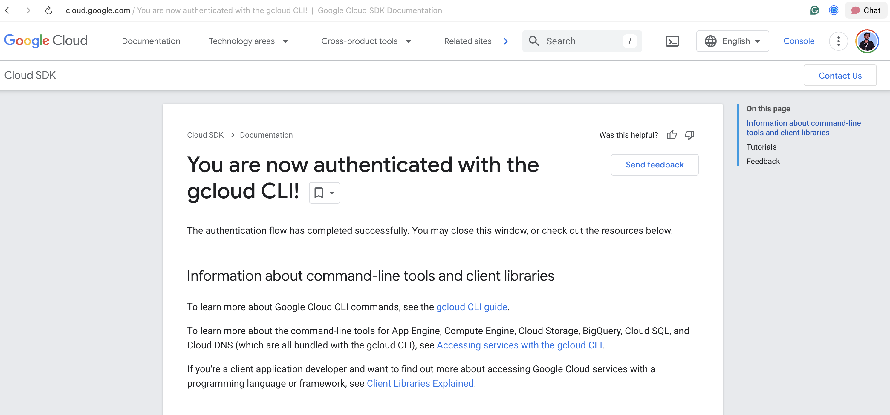

# Gemini Veo 3 Sketch2Video Generator

Convert your sketches and drawings into videos using Google's Gemini and Veo AI models.

## Features

- Upload sketches or drawings
- Add custom prompts to guide video generation
- Generate videos using Google's Veo AI
- Download generated videos

## Prerequisites

1. **Google Cloud Project**: You need a Google Cloud project with the following APIs enabled:
   - Vertex AI API
   - Cloud Storage API

2. **Google API Key**: Get your API key from [Google AI Studio](https://makersuite.google.com/app/apikey)

3. **Google Cloud Storage Bucket**: Create a bucket for storing generated content

## Setup Instructions

### 1. Clone and Navigate
```bash
cd multimodal-apps/gemini-veo-sketch2video
```

### 2. Install Dependencies
```bash
pip install -r requirements.txt
```

### 3. Set Up Environment Variables

Create a `.env` file in the project directory with the following content:

```env
# Google Cloud Configuration
GOOGLE_API_KEY=your_google_api_key_here
PROJECT_ID=your_google_cloud_project_id
GCS_BUCKET_NAME=your_gcs_bucket_name
GOOGLE_CLOUD_REGION=us-central1

# Alternative authentication (optional)
# GOOGLE_APPLICATION_CREDENTIALS=path/to/service-account-key.json
```

**Important**: Replace the placeholder values with your actual credentials!

### 4. Get Your Google API Key

1. Go to [Google AI Studio](https://makersuite.google.com/app/apikey)
2. Sign in with your Google account
3. Click "Create API Key"
4. Copy the API key and add it to your `.env` file

### 5. Set Up Google Cloud

#### Option A: Using Google Cloud Console
1. Go to [Google Cloud Console](https://console.cloud.google.com/)
2. Create a new project or select existing one
3. Enable the following APIs:
   - Vertex AI API
   - Cloud Storage API
4. Create a Storage bucket
5. Update your `.env` file with project ID and bucket name

#### Option B: Using Service Account (Alternative)
If you prefer using a service account instead of API keys:

1. Create a service account in Google Cloud Console
2. Download the JSON key file
3. Set the environment variable:
   ```bash
   export GOOGLE_APPLICATION_CREDENTIALS=path/to/service-account-key.json
   ```

4. Authenticate in your terminal:
   ```bash
   gcloud auth application-default login
   ```

   

### 6. Verify Your Setup

Before running the application, use the setup verification script:

```bash
python check_setup.py
```

This will check all your environment variables, dependencies, and Google Cloud connectivity.

### 7. Run the Application

```bash
python app.py
```

The application will be available at `http://localhost:5001`

## Usage

1. Open `http://localhost:5001` in your browser
2. Upload a sketch or drawing (PNG, JPG, JPEG supported)
3. Optionally add a text prompt to guide the video generation
4. Click "Generate Video" and wait for processing
5. Download the generated video once complete

## Troubleshooting

### Common Issues

1. **500 Internal Server Error**
   - Check that all environment variables are set correctly
   - Verify your Google API key is valid
   - Ensure your Google Cloud project has the required APIs enabled

2. **Authentication Errors**
   - Double-check your `GOOGLE_API_KEY` in the `.env` file
   - Make sure your Google Cloud project ID is correct
   - Verify the GCS bucket exists and is accessible

3. **Missing Static Files (404 errors)**
   - The static CSS and JS files should now be created automatically
   - If issues persist, check that the `static/` directory contains `style.css` and `script.js`

4. **Module Not Found Errors**
   - Run `pip install -r requirements.txt` to install all dependencies
   - Consider using a virtual environment:
     ```bash
     python -m venv venv
     source venv/bin/activate  # On Windows: venv\Scripts\activate
     pip install -r requirements.txt
     ```

### Checking Your Setup

You can verify your setup by checking:
1. Environment variables are loaded: The app will log warnings for missing variables
2. Google API connectivity: Try making a simple API call
3. GCS bucket access: Check if the bucket exists and is accessible

## API Endpoints

- `GET /`: Main application interface
- `POST /generate`: Generate video from sketch
  - Request body: `{"image_data": "base64_image", "prompt": "optional_text"}`
  - Response: `{"video_url": "path_to_generated_video"}`

## Dependencies

- Flask: Web framework
- google-generativeai: Google AI API client
- google-cloud-storage: Google Cloud Storage client
- python-dotenv: Environment variable management
- Pillow: Image processing
- requests: HTTP client library

## License

MIT License